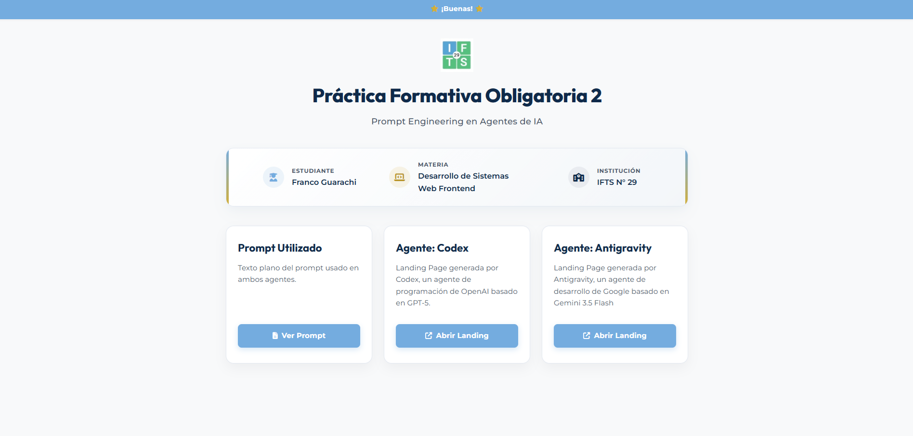
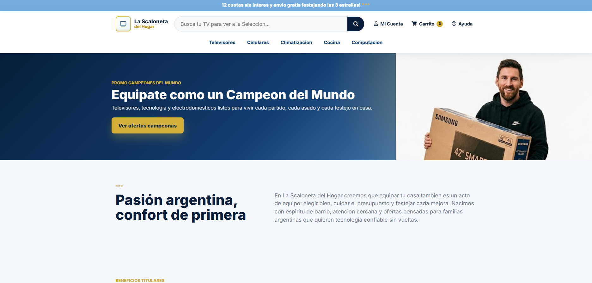
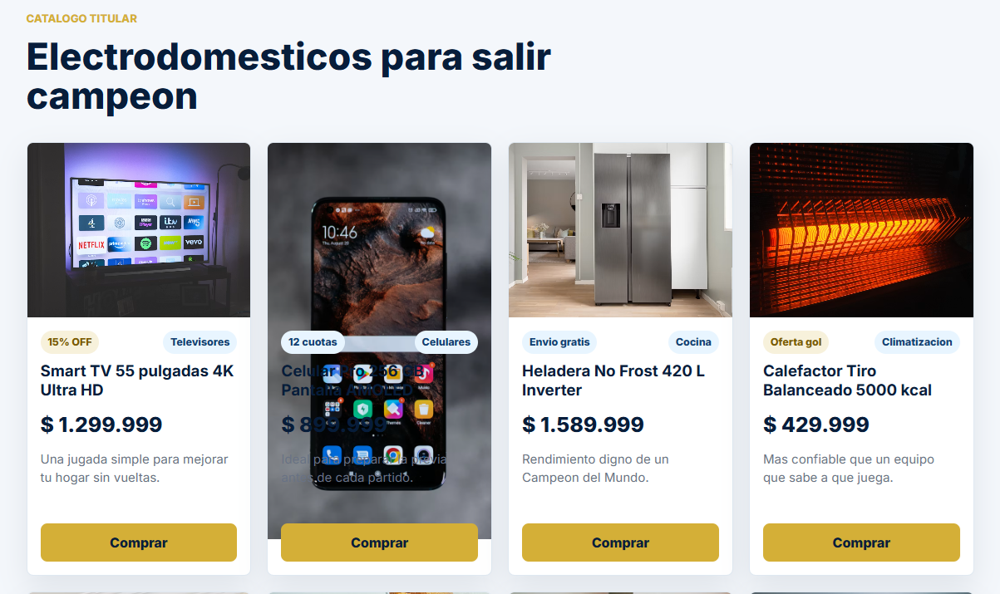
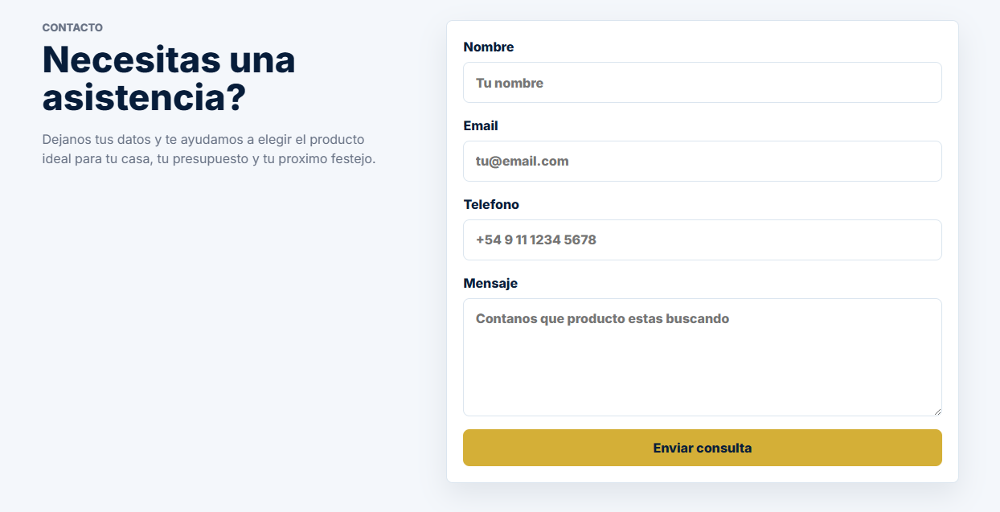
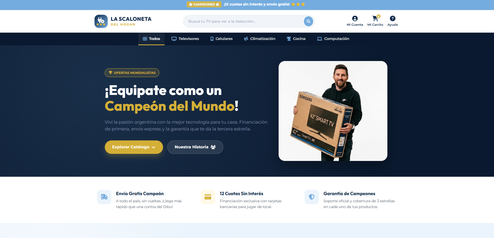
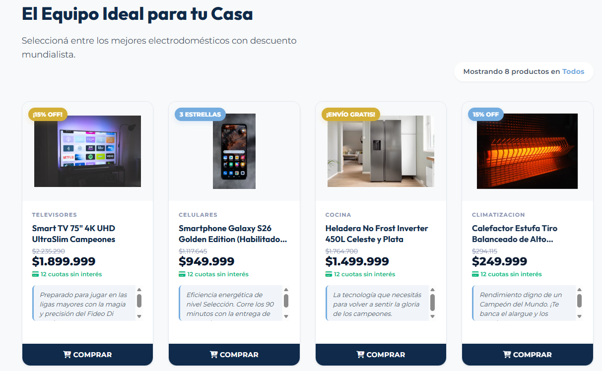
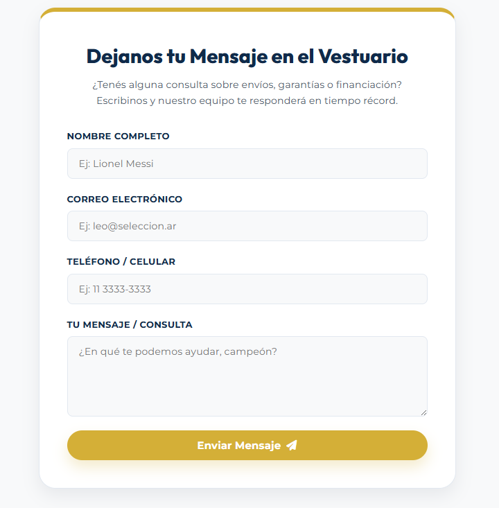

# Práctica Formativa Obligatoria 2

## Información
* **Alumno:** Franco Guarachi
* **Materia:** Desarrollo de Sistemas Web Frontend
* **Institución:** IFTS N° 29
* **Agentes Utilizados:** Codex (OpenAI) y Antigravity (Google AI)

---

## Descripción del Proyecto
Este proyecto consiste en una práctica comparativa orientada al uso de *Prompt Engineering* en agentes autónomos de Inteligencia Artificial para el desarrollo de interfaces web. A partir de un solo prompt (bien armado), dos agentes diferentes (Codex y Antigravity) generaron por separado una Landing Page completa para un e-commerce ficticio de venta de electrodomésticos ambientado en la Selección Argentina (Muchaachoos). 

La estructura del repositorio incluye una portada principal que sirve como nexo y distribuidor hacia los trabajos individuales de cada agente y un apartado para ver el prompt base.

---

## Deploy en Vercel

👉 **[Ver Deploy en Vercel](https://pfo-2-individual.vercel.app/)** 

---

## Tecnologías Utilizadas
* **HTML5 Semántico** para la estructuración y accesibilidad de la portada y las landing pages.
* **CSS3 Vanilla** nativo (utilizando CSS Variables, Flexbox y CSS Grid) para el estilado responsive y moderno de las páginas.
* **JavaScript Vanilla** para el dinamismo de las tarjetas de productos, la aleatoriedad de las frases y la edición en caliente de las descripciones.
* **FontAwesome (CDN)** para las fuentes de iconos vectoriales en la interfaz.
* **Google Fonts** para las familias tipográficas modernas (*Montserrat*, *Outfit* e *Inter*).

---

## Prompt Utilizado
A continuación se detalla el prompt base estructurado utilizado para instruir a los agentes:

<details>
<summary><b>🔍 Expandir el Prompt de Instrucciones</b></summary>

```markdown
Adopta el rol de un Desarrollador Frontend Senior especializado en E-commerce, Diseño Web Moderno y UX/UI. Tu tarea es escribir el código completo e inmediatamente funcional para una página web de venta de electrodomésticos con temática mundialista argentina (inspirada en la Selección Argentina, Lionel Messi y los colores celeste, blanco y dorado).

Sigue detenidamente las instrucciones delimitadas por etiquetas a continuación para generar el código.

<contexto_del_proyecto>
- País de enfoque: Argentina.
- Moneda: Pesos Argentinos (ARS) con formato local (ej. $1.299.999).
- Temática visual: Mundialista/Selección Argentina ("La Scaloneta del Hogar"). Colores predominantes: Celeste (#74ACDF), Blanco (#FFFFFF), Dorado Copa del Mundo (#D4AF37) y detalles en Azul Oscuro para contraste y legibilidad.
</contexto_del_proyecto>

<descripcion_visual_y_layout>
El diseño debe seguir una estructura limpia, moderna y de alta conversión típica de las grandes tiendas de electrodomésticos, estructurada de la siguiente manera:
1. **Barra de Anuncios Superior**: Una franja delgada de fondo celeste (#74ACDF) con texto blanco centrado que resalte promociones mundialistas (ej. "¡12 cuotas sin interés y envío gratis! ⭐⭐⭐").
2. **Cabecera Principal (Header)**: 
   - Logo en el extremo izquierdo (un isotipo estilizado de un electrodoméstico con detalles dorados).
   - Una gran barra de búsqueda centralizada y alargada con esquinas redondeadas, un placeholder persuasivo (ej. "Buscá tu TV para ver a la Selección...") y un botón con icono de lupa.
   - Iconos de utilidad en el extremo derecho (Mi Cuenta, Carrito con indicador numérico de productos, Ayuda).
3. **Menú de Categorías**: Una barra horizontal inferior en el header con enlaces limpios para filtrar rápidamente (Televisores, Celulares, Climatización, Cocina, Computación).
4. **Hero Section**: 
   - Un banner de gran impacto a ancho completo.
   - Fondo con degradado elegante que va desde el azul oscuro hasta el celeste de la selección, con la imagen de Lionel Messi o la Selección Argentina integrada armoniosamente (no sobrepuesta toscamente).
   - Textos alineados a la izquierda con tipografía sans-serif moderna, títulos grandes y un botón de acción (CTA) de color dorado brillante (#D4AF37) que cambie de tono al pasar el cursor (hover).
5. **Grilla de Catálogo (Product Grid)**:
   - Una distribución responsiva de tarjetas de producto: 4 columnas en pantallas de escritorio, 2 en tablets y 1 en móviles.
   - Tarjetas (Cards) de fondo blanco puro, bordes redondeados y una sombra muy suave (`box-shadow`) que se intensifica sutilmente al pasar el ratón por encima (efecto hover).
   - Cada tarjeta debe tener la imagen del producto centrada en un contenedor gris muy claro (#F8F9FA) para dar homogeneidad visual, seguida por el título del producto en color oscuro, una etiqueta destacada en celeste o dorado (ej. "¡15% OFF!"), el precio en tipografía grande y negrita, el área de la descripción dinámica, y un botón de "Comprar" ocupando todo el ancho inferior de la tarjeta.
</descripcion_visual_y_layout>

<estructura_html>
El sitio debe constar de una sola página (Single Page) estructurada de forma semántica con las siguientes secciones:
1. **Cabecera**: Implementada siguiendo las pautas de layout descritas anteriormente.
2. **Hero Section**: Banner principal con título motivacional (ej. "¡Equipate como un Campeón del Mundo!"), subtítulo y botón CTA que dirija directamente al catálogo.
3. **Descripción / Sobre Nosotros**: Un bloque estético donde se explica la historia de la tienda bajo el lema del esfuerzo de la selección y la pasión argentina, decorado con tres estrellas doradas.
4. **Servicios / Características Principales**: Sección de beneficios con iconos (ej: "Envío gratis a todo el país", "Garantía de Campeones", "Financiación en 12 cuotas sin interés").
5. **Catálogo de Electrodomésticos**:
   - Grid de productos que muestre los siguientes artículos con precios realistas en pesos argentinos (ARS):
     - Televisión Smart (TV)
     - Celular
     - Heladera
     - Estufa / Calefactor
     - Aire Acondicionado
     - Air Fryer
     - Cocina
     - Computadora
   - Cada tarjeta debe incluir la imagen, el precio, la descripción aleatoria inicial y el botón de "Comprar".
6. **Testimonios / Reseñas de Clientes**: Sección con opiniones de clientes satisfechos expresadas con jerga futbolera argentina (ej. "¡Una compra de diez, más rápido que el Dibu!").
7. **Formulario de Contacto**: Maquetado visual moderno con campos para Nombre, Email, Teléfono y Mensaje (sin funcionalidad backend).
8. **Pie de Página (Footer)**: Enlaces rápidos, copyright y enlaces a redes sociales (iconos simulados).
</estructura_html>

<recursos_visuales_estables>
Usa estrictamente las imagenes de la carpeta img, cada una tiene un nombre que le corresponde al producto a vender (ej. `televisor.avif`, `celular.avif`, `heladera.avif`, `estufa.avif`, `aire_acondicionado.avif`, `freidora_aire.avif`, `cocina.avif`, `computadora.avif`).
</recursos_visuales_estables>

<funcionalidad_javascript>
Debes implementar con JavaScript vanilla las siguientes interacciones:
1. **Generación de Descripciones Aleatorias**: Al cargar la página, cada electrodoméstico debe recibir una descripción aleatoria seleccionada de un array de frases predefinidas divertidas y relacionadas con la Scaloneta o el mundial (ej. "¡Tan potente como un remate de Messi al ángulo!", "Ideal para enfriar las bebidas antes del partido", "Rendimiento digno de un Campeón del Mundo").
2. **Modificación de Descripciones**: 
   - Cada tarjeta debe contar con un botón "Editar Descripción".
   - Al hacer clic, debe permitir al usuario editar la descripción directamente en la tarjeta (por ejemplo, reemplazando el texto por un input/textarea en caliente) o abrir un modal sencillo donde pueda modificarla.
   - Debe incluir un botón para "Guardar" o "Cancelar" la edición, actualizando el texto de la descripción en tiempo real en la tarjeta.
</funcionalidad_javascript>

<restricciones_tecnicas>
- Utiliza únicamente HTML5 puro, CSS3 vanilla moderno (utilizando variables CSS para la paleta de colores, Flexbox y CSS Grid para la distribución) y JavaScript vanilla.
- No utilices frameworks de CSS (como Tailwind o Bootstrap) ni frameworks de JS (como React, Vue o Angular).
- El diseño debe ser totalmente responsivo (móvil, tablet y escritorio).
- No agregues funcionalidades backend, bases de datos ni dependencias externas complejas. Si usas iconos, consúmelos mediante CDN público (como FontAwesome o Lucide).
</restricciones_tecnicas>

<formato_de_entrega>
Genera la solución completa organizada de la siguiente manera:
1. Código HTML (`index.html`).
2. Código CSS (`styles.css`).
3. Código JavaScript (`app.js`).
Asegúrate de que todo el código esté limpio, bien estructurado, libre de marcadores de posición (placeholders) e inmediatamente funcional al vincular los archivos.
</formato_de_entrega>
```

</details>

---

## Análisis visual y Conclusión

Codex y Antigravity diseñaron algo visualmente bueno, es lo que esperaba, sin embargo podría ser mejor. Por un lado el diseño de Codex tiene errores visuales en la imagen de Messi con la tv, tambien en las imagenes de los productos hay un problema con las dimensiones, lo que provoca una superposicion no deseada y hace que se vea mal. A pesar de los errores, es funcional y cumple con lo pedido.
En el caso de Antigravity veo una mejoria notable en el uso de colores, las imagenes estan bien colocadas y se adaptan mejor al diseño aunque quedan espacios vacios que no quedan tan bien. El footer es mas completo, tiene mas opciones. En ambos se crearon botones que no llegan a nada, lo cual es entendible porque no fueron aclarados en el prompt.

En conclusión, este experimento demuestra el comportamiento de dos arquitecturas de IA, a partir del codigo que nos generan se puede crear algo mucho mejor, llegando a tener una pagina bien hecha y funcional.

---

## Capturas

### Portada Principal


### Landing Page - Codex





### Landing Page - Antigravity







